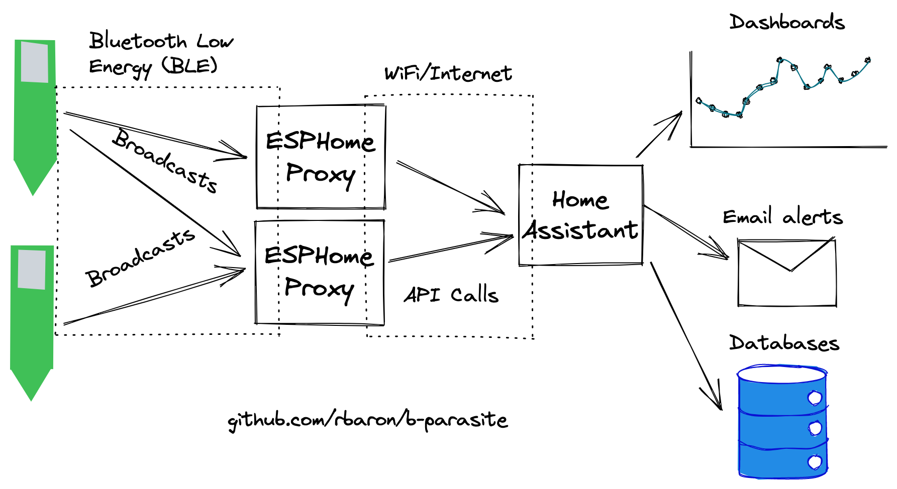
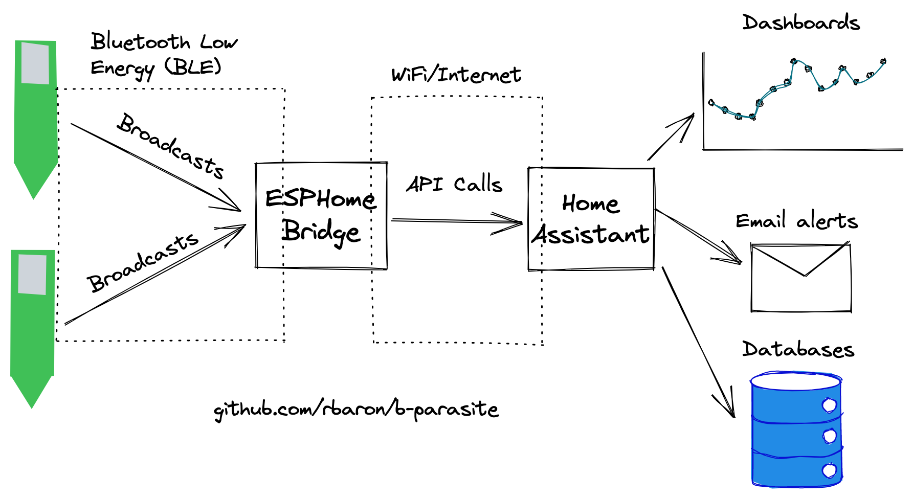
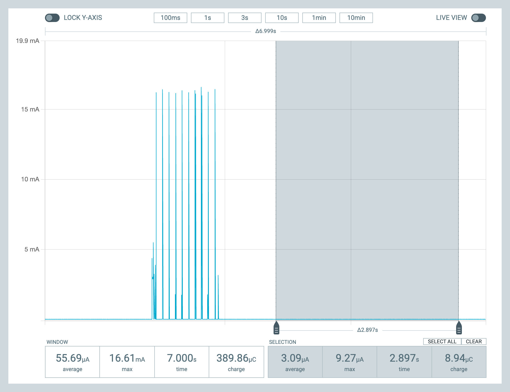
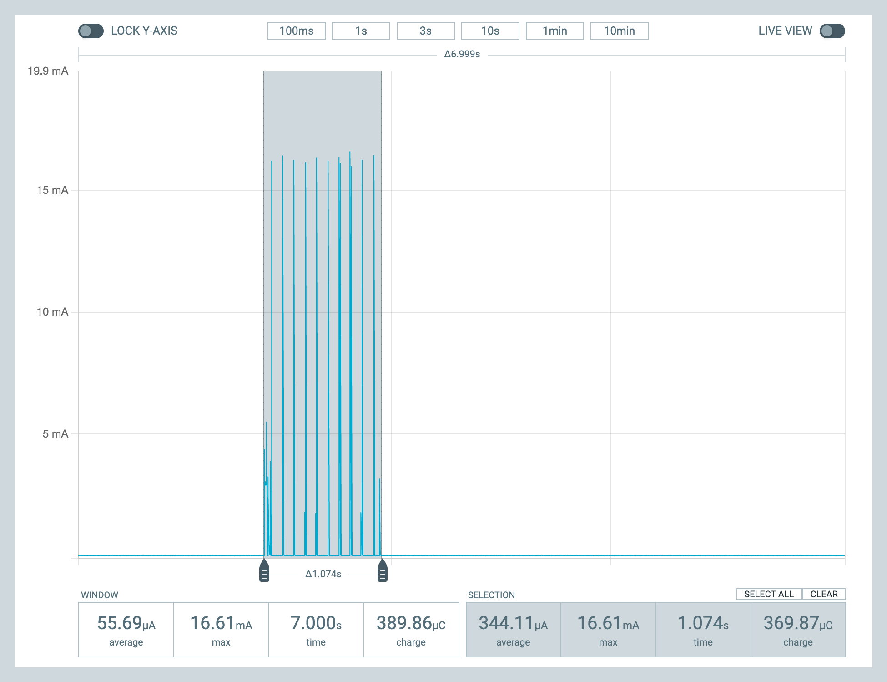

# Bluetooth Low Energy (BLE)
In this saple, b-parasite sensors are periodically read and broadcast using Bluetooth Low Energy (BLE) dvertising packets.

## Configuration
Available configurations and their default values are in [`Kconfig`](./Kconfig). They are set in [`prj.conf`](./prj.conf). Here are some notable examples.

### Sleep Interval
To save energy, the board spends most of the time in a "deep sleep" state, in which most peripherals and radio are completely turned off. The period of sleep is controlled by the `PRST_SLEEP_DURATION_SEC` config.

### Advertising Duration
When it wakes up, the sample reads all sensors and keep broadcasting advertising packets for `PRST_BLE_ADV_DURATION_SEC` before going back to sleep.

### Advertising Packet Encoding
There are different ways to encode the sensor data in a BLE advertising packet.

#### BTHome Encoding
[BTHome](https://bthome.io) is a new (as of Dec/2022) open standard for encoding sensor data in BLE applications. [Home Assistant](https://www.home-assistant.io/integrations/bthome/) supports it out of the box. This makes the deployment extra convenient, since no additional configuration is needed - Home Assistant will automatically detect b-parasites in range.

What's even more interesting is that by employing [ESPHome](https://esphome.io/) bridges with the [`bluetooth_proxy`](https://esphome.io/components/bluetooth_proxy.html) component, the range of BLE coverage can be transparently increased. Multiple ESPHome bridges will forward received BLE broadcasts to Home Assistant.

This is what a typical deployment with BTHome looks like:

There are two versions of BTHome encodings supported by this sample:
* `PRST_BLE_ENCODING_BTHOME_V1=y` uses the [legacy BTHome V1](https://bthome.io/v1/), which was briefly in use
* `PRST_BLE_ENCODING_BTHOME_V2=y` uses the [BTHome V2](https://bthome.io/format/), which is not yet (as of early Dec/2022) in the stable Home Assistant release. This will soon become the default.

#### b-parasite Encoding
`PRST_BLE_ENCODING_BPARASITE_V2=y` selects the "legacy" encoding, used historically inn this project. This is the encoding that the [`b_parasite`](https://esphome.io/components/sensor/b_parasite.html) ESPHome component understands.

With this encoding and a ESPHome + `b_parasite` component, this is an usual deployment topology:

The disadvantages of this encoding are:
- Each b-parasite has to be configured in the ESPHome component
- Range is limited, unless multiple ESPHome bridges are deployed with the same static configuration

## Battery Life
**tl;dr**: Theoretically well over two years with default settings.

While in deep sleep, the board consumes around `3.0 uA`:

In the active broadcasting state, with default settings, the average current consumption is around `344 uA`:

With a `200 mAh` CR2032 battery, we can use [this spreadsheet](https://docs.google.com/spreadsheets/d/157JQiX20bGkTrlbvWbWRrs_WViL3MgVZffSCWRR7uAI/edit#gid=0) to estimate the battery life to over two years. Note that this is a simplified model and results in practice may vary.